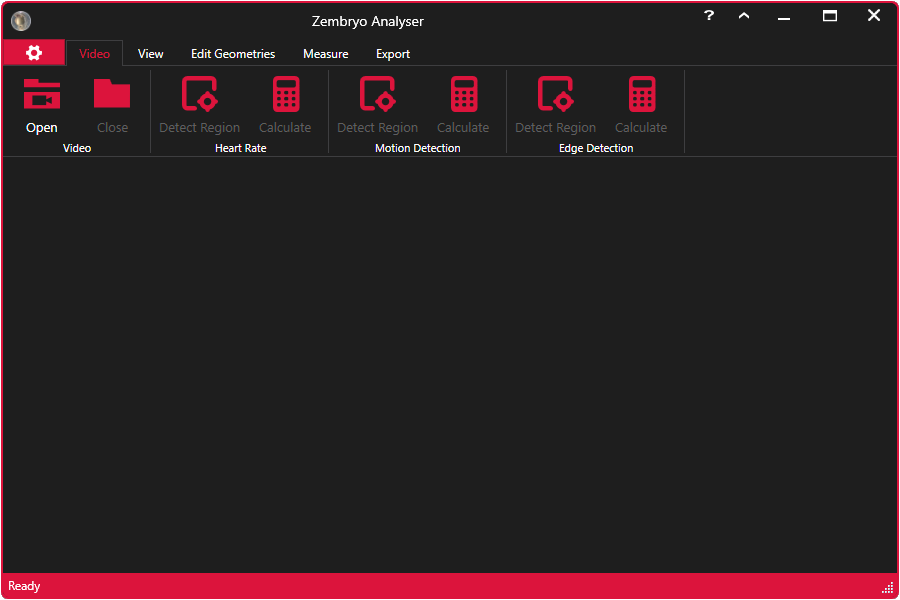

# ZembryoAnalyser
ZembryoAnalyser is an application that allows the extraction of color intensity information in regions of interest in videos. The information can be presented in different ways, which makes further analysis easier.

In addition to information on the intensity of colors in the regions, the application also allows you to determine the length of lines or polylines in any frame of the video, as well as the area of the regions which can be drawn freehand.

# Libraries

Application uses [OpenCVSharp](https://github.com/shimat/opencvsharp/) library to extract frames from the video and calculate data.

Application uses the [Crystalbyte ribbon](https://github.com/crystalbyte/ribbon/) library for Application Design.

[OxyPlot](https://github.com/oxyplot/oxyplot/) library is used to display plot and export images of the plot.

[OpenXML SDK](https://github.com/OfficeDev/Open-XML-SDK/) is used to generate XLSX.

For PDF generation [PDFsharp](https://github.com/empira/PDFsharp/) library is used.

# More information

More information about application usage can be found on [Wiki page](https://github.com/darkopuflovic/ZembryoAnalyser/wiki).
